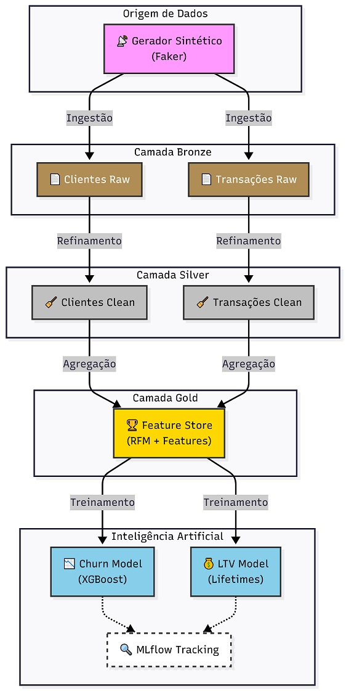

# Customer Intelligence 360: Data Lakehouse & ML Analytics

_Esse projeto não é apenas sobre "dados" (Data Lake) ou "algoritmos" (Machine Learning). O objetivo final é extrair inteligência sobre o cliente. Métricas como Churn e LTV são a essência da inteligência de cliente: saber quem fica, quem sai e quem gasta._

## Projeto

## Implementação Completa de um Data Lakehouse Moderno com Spark, Delta Lake e MLOps para Predição de Churn e LTV.

Este manual reúne todas as fases de implementação do projeto, desde a configuração da infraestrutura até o treinamento dos modelos de Machine Learning. Ele foi desenhado para ser autossuficiente: contém tanto as explicações teóricas quanto o código-fonte integral, permitindo que qualquer engenheiro reproduza o ambiente do zero.


---

## 🏢 Simulação de Cenário Real & Valor de Negócio

Este projeto simula o ambiente de dados de uma **empresa de Varejo/E-commerce ou SaaS** que já possui maturidade transacional (vendas ocorrendo), mas carece de inteligência analítica.

**A Solução Fornecida:**
Implementamos uma "Plataforma de Dados Moderna" (Lakehouse) que atua como o cérebro da empresa. Ela centraliza dados dispersos e devolve insights acionáveis:

1.  **Visão Unificada (Customer 360):** Integração de dados de perfil (Quem é?) com dados comportamentais (O que comprou?).
2.  **Saúde Financeira:** Substituição de planilhas manuais por pipelines automáticos que calculam métricas vitais como **RFM** (Recência, Frequência, Monetário).
3.  **Inteligência Preditiva:** O sistema deixa de olhar apenas para o "retrovisor" (o que aconteceu) e passa a olhar para o "para-brisa" (o que vai acontecer: Churn e LTV).

---

## 🧠 Visão Geral da Arquitetura


O projeto implementa um **Pipeline Analítico Batch confiável**, utilizando **Spark, Delta Lake e MLflow**, com foco em qualidade de dados, governança e reprodutibilidade.

A solução segue o padrão de **Arquitetura Medalhão**, organizando os dados em camadas:


- **Bronze:** dados brutos (Delta Lake)
- **Silver:** dados limpos e deduplicados

- **Gold:** dados agregados para Analytics/ML (Feature Store)

---

## 🎯 O Problema de Negócio: Por que Churn e LTV?

Para qualquer empresa de varejo ou assinatura, **manter clientes existentes é muito mais barato do que conquistar novos**. Este projeto ataca diretamente a rentabilidade da empresa respondendo a duas perguntas críticas:

1.  **Quem está saindo? (Churn Rate)**
    *   **O Problema**: Perder clientes sem perceber.
    *   **A Solução (XGBoost)**: Um modelo classificador que analisa o histórico de compras e identifica, com antecedência, quais clientes têm alta probabilidade de não comprar mais. Isso permite ações de retenção preventivas.

2.  **Quem são os melhores clientes? (LTV - Lifetime Value)**
    *   **O Problema**: Tratar todos os clientes de forma igual.
    *   **A Solução (Lifetimes)**: Um modelo probabilístico que prevê **quanto dinheiro** cada cliente ainda vai gastar no futuro. Isso permite focar investimentos de marketing nos clientes "Baleia" (alto valor) e não desperdiçar recursos em clientes de baixo retorno.

**O Objetivo Final**: Transformar dados brutos em lucro, automatizando a segmentação de clientes para equipes de Marketing e CRM.





---

## 🏗️ Estrutura do Projeto (Fases)

O projeto foi dividido em capítulos lógicos para facilitar a implementação e o estudo. Confira abaixo o que cada fase explora:

### 🟢 Configuração e Infraestrutura (Capítulo 1)
Estabelecimento da fundação sólida para o projeto.
- **Foco:** Git, Poetry, Makefile, e configuração do Spark com Delta Lake.
- **Objetivo:** Criar uma estrutura profissional que suporta processamento em larga escala.

### 🟢 Geração de Dados (Capítulo 2)
Como não utilizamos dados reais de clientes (LGPD), simulamos um ambiente produtivo.
- **Foco:** Criação de dados sintéticos de clientes e transações usando `Faker`.
- **Resultado:** Arquivos `.parquet` simulando logs de sistemas transacionais.

### 🟢 Camada Bronze (Capítulo 3)
A porta de entrada do Data Lake.
- **Foco:** Ingestão de dados brutos (`raw`) para Delta Lake.
- **Destaque:** Validação básica de contrato (Data Contracts) para garantir integridade.

### 🟢 Refinamento Silver (Capítulo 4)
Onde os dados ganham qualidade e confiança.
- **Foco:** Limpeza, deduplicação e tipagem dos dados.
- **Transformação:** Conversão de formatos brutos para tipos estruturados (Dates, Timestamps).

### 🟢 Agregação Gold (Capítulo 5)
Criação da visão de negócio e inteligência.
- **Foco:** Criação de uma Feature Store com engenharia de atributos.
- **Técnica:** RFM (Recência, Frequência, Monetário) para perfilamento de clientes.

### 🟢 Machine Learning (Capítulo 6)
Aplicação de inteligência preditiva sobre os dados governados.
- **Foco:** Treinamento de modelos produtivos.
- **Modelos:**
    - **Churn:** Classificação com XGBoost.
    - **LTV:** Regressão Probabilística com Lifetimes.
- **Ops:** Tracking completo de experimentos e artefatos com MLflow.

### 🟢 CI/CD & Testes (Capítulo 7)
A garantia de qualidade e automação do ciclo de vida do software.
- **Foco:** Pipeline de Integração Contínua e execução de testes automatizados.
- **Testes:**
    - **Smoke Test:** Validação de infraestrutura Spark.
    - **Integration Test:** Validação de lógica de negócio (deduplicação Silver).
- **Automação:** Workflow no GitHub Actions para execução de testes a cada push.


---

## 🤖 Enquadramento de Machine Learning

Este projeto é **híbrido**, pois utiliza **dois tipos diferentes de modelos de aprendizado**, que se complementam para dar uma visão 360 do cliente.

Aqui está o enquadramento exato:

### 1. Modelo de Churn (Rotatividade)
*   **Tipo de Aprendizado:** **Aprendizado Supervisionado** (Supervised Learning).
*   **Tarefa:** **Classificação Binária** (Binary Classification).
*   **Explicação:** O modelo recebe dados rotulados do passado (clientes que saíram vs. clientes que ficaram) e aprende a classificar novos clientes em duas categorias: "Vai sair (1)" ou "Vai ficar (0)".
*   **Algoritmo Usado:** XGBoost (Gradient Boosting), que é uma técnica baseada em árvores de decisão, não em Deep Learning.

### 2. Modelo de LTV (Lifetime Value)
*   **Tipo de Aprendizado:** **Modelagem Probabilística Generativa** (Probabilistic Generative Modeling) / **Não Supervisionado** (em certos contextos, pois não exige um target "futuro" explícito para treinar os parâmetros latentes, mas valida-se com dados futuros).
*   **Tarefa:** **Regressão** (Regression) e Predição de Contagem.
*   **Explicação:** Não é uma regressão linear comum. O modelo estima parâmetros ocultos de comportamento (taxa de compra e taxa de morte do cliente) para projetar uma curva futura de valor. É estatística clássica aplicada (modelos BG/NBD e Gamma-Gamma).
*   **Algoritmo Usado:** Lifetimes (Beta-Geometric/Negative Binomial Distribution).

---

## 🚀 Execução Rápida


Para reproduzir este projeto em seu ambiente local:

```bash
# 1. Configuração Inicial
make setup

# 2. Pipeline de Dados (ETL Completo)
make etl

# 3. Treinamento de Modelos
make train
```

---

## 📝 Autor

**Saulo Santos**

- GitHub: [https://github.com/Prof-Saulo-Santos](https://github.com/Prof-Saulo-Santos)
- LinkedIn: [https://www.linkedin.com/in/santossaulo/](https://www.linkedin.com/in/santossaulo/)
